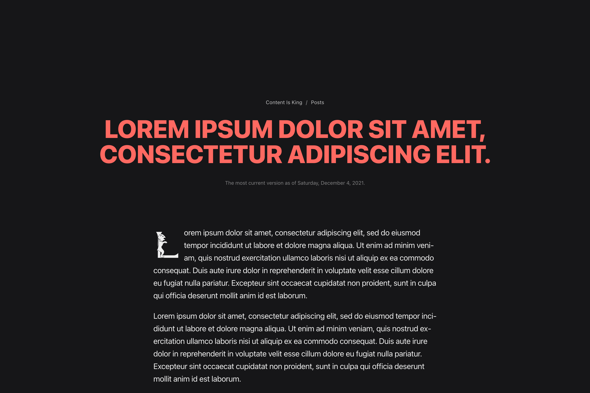

# Content first Hugo Theme
This Hugo theme focuses purely on content: Content is king. Layout and appearance are simply by design. The primary goal of the theme is to give the website visitor maximal user experience for reading and enjoying the published content elegantly. No Sidebars or any other annoying elements that interrupt the reading experience.



## Installation
1. Install dependencies: The theme makes use of the following theme components, please follow the instructions of the projects `README.adoc` files:
   1. [Hugo Theme Component: Asciidoctor Skin](https://github.com/devidw/hugo-theme-component-asciidoctor-skin)
3. Clone this theme to your `themes` directory
```cmd
git submodule add https://github.com/devidw/hugo-theme-cik ./themes/hugo-theme-cik
```
3. Add this theme to your list of themes inside your config-file
Using `config.toml`
```toml
theme = ["…", "hugo-theme-cik", "…"]
```
Using `config.yaml`
```yaml
theme: ["…", "hugo-theme-cik", "…"]
```
or
```yaml
theme: 
  - "…"
  - "hugo-theme-cik"
  - "…"
```


## Update
```cmd
git submodule update --init --recursive --remote
```


## Configuration

### Params

#### Main Sections
Please specifiy in which sections you posts are located:
```yaml
mainSections:
  - posts
```
#### Author
```yaml
author: 
  name: David Wolf
  email: david@wolf.gdn
  signature: signature.svg # static file path
```

#### Payments
Generates `<link rel=payment>` links and adds them to the `<head>`

```yaml
payments:
  - https://paypal.me/devidwolf
  - https://buymeacoffee.com/dwolf
```

#### Theme color
```yaml
themeColor: "#8b7355"
```

#### Icons
```yaml
icons:
  favicon: logo.svg
  touchIcon: logo.svg # Safari
  maskIcon: logo.svg # Safari
```


### Frontmatter

#### No index
```yaml
noindex: true
```

* sets robots meta tag
* excludes via `robots.txt`
* excludes from `sitemap.xml`
* excludes from RSS feed

<!-- #### Math
```yaml
math: true
```

* Enables [KaTeX](https://katex.org) math rendering for the given page -->


### Styles
You can add additional custom styles to the Hugo theme via the `/assets/sass/_custom.sass` file.

If there is no `/assets/sass/_custom.sass` file in your project you can simply create it.

#### Using SASS
Simply add your SASS rules into `_custom.sass`.

All your custom styles will be compiled from SASS to CSS and minified automatically via Hugo pipes.

#### Using SCSS or CSS
If you not so familiar with SASS you can also write SCSS or just plain CSS.

To do so you only have to import your `.scss` or `.css` file into `_custom.sass` by doing a SASS-import using the `@import` method.

```sass
@import <filename>
```

##### Example
Say you want to include some CSS styles, which you write into `/assets/sass/my-custom-styles.css`.

To add them to the theme you add the following into `/assets/sass/_custom.sass`:

```sass
@import my-custom-styles
```

Do not include the file extension like `.scss` or `.css` in the path of the `@import` rule.
